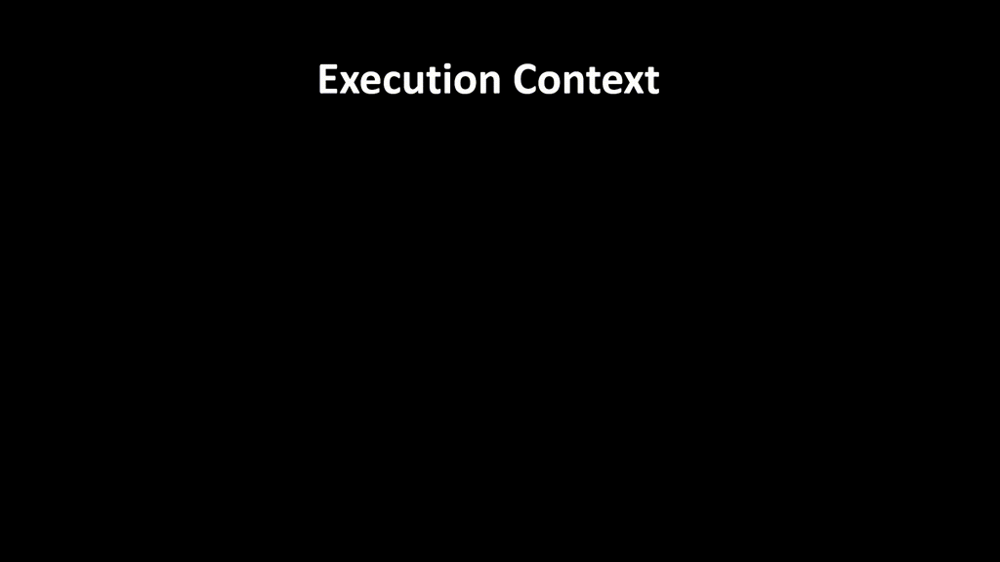
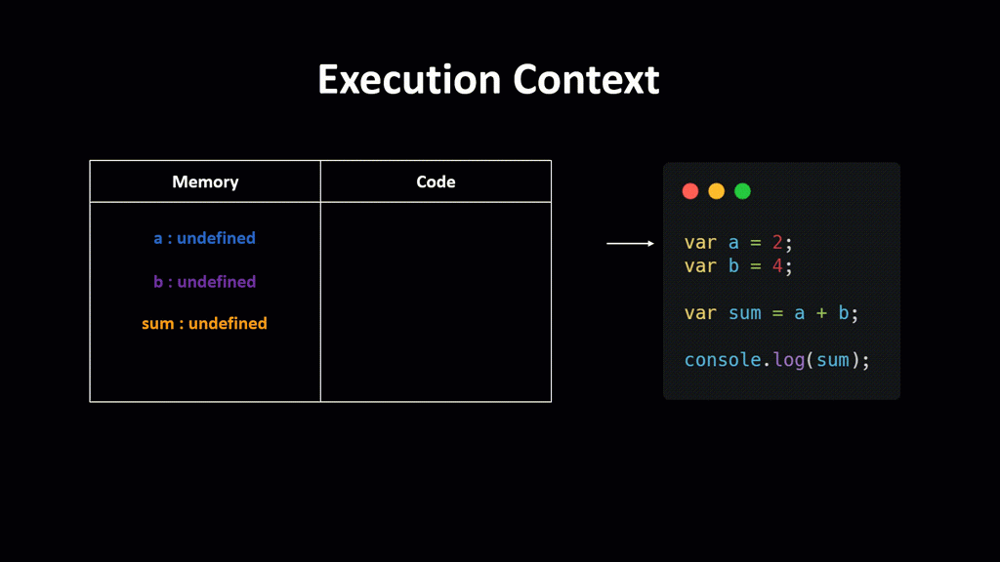
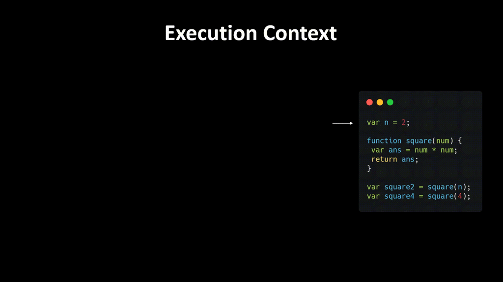
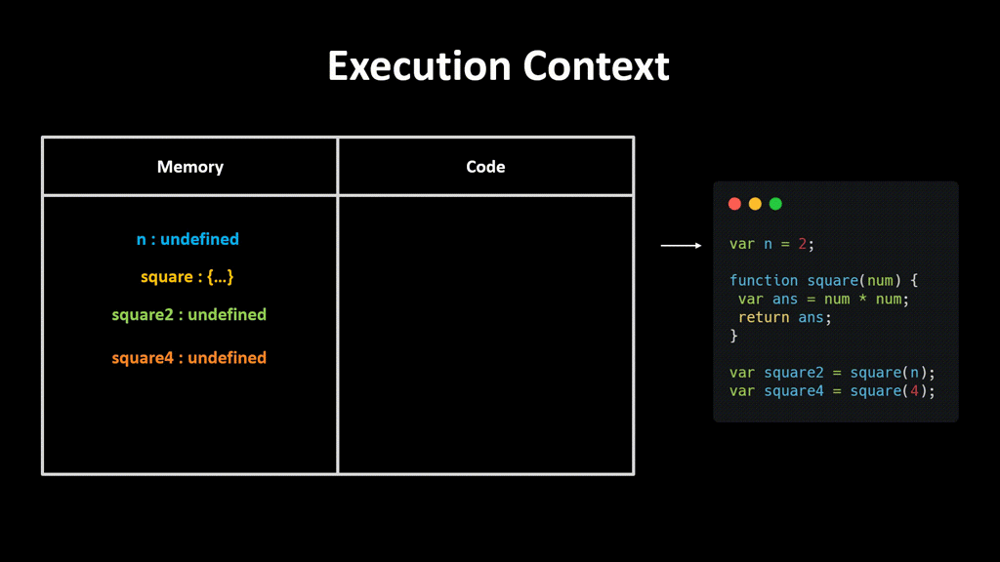
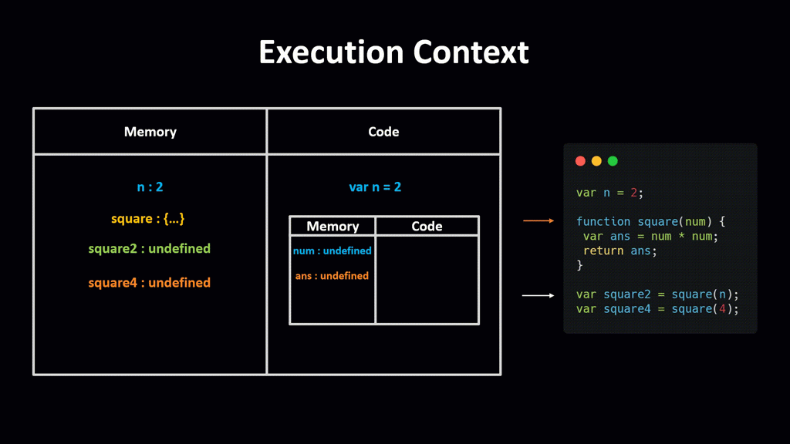
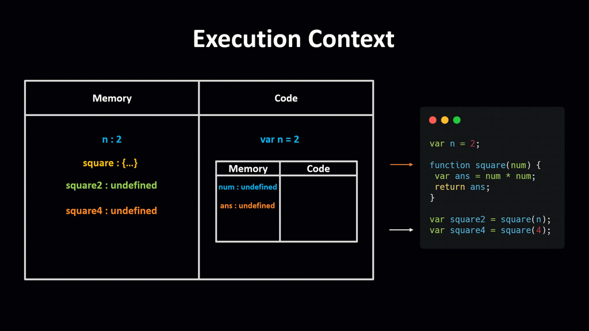

# **Hoisting**

> JavaScript **Hoisting** refers to the process whereby the interpreter appears to move the declaration of functions, variables or classes to the top of their scope, prior to execution of the code.

<br />

Thus, variables can appear in code before they are even defined. However, the variable initialization will only happen until that line of code is executed.

```js
    func() // JS

    function func() {
        console.log('JS')
    }
```

## **Execution Context**

When a Javascript engine executes code, it creates execution context. Each context has two phases: creation and execution.

### **Creation Phase**

When a script executes, the JS engine creates a **Global Execution Context**. In this phase, it performs the following tasks:

- Create a global object ```window``` in the web browser or ```global``` in Node.js.
- Create the ```this``` object and bind it to the global object.
- Setup a memory heap for storing variables and function references.
- Store the function declarations in the memory heap and variables within the global execution context with the initial values as ```undefined```.

### **Execution Phase**
At this phase, the JS engine executes the code line by line. But by virtue of hoisting, the function is declared regardless of line order, so there is no problem calling/invoking the method prior the declaration.

For every function call, the JS engine creates a new **Function Execution Context**. This context is similar to **global execution context**, but instead of creating the global object, it creates the ```arguments``` object that contains references to all the parameters passed to the function

<br />
<br />

## **Execution of the code**
<br />

```js
var a = 2;
var b = 4;

var sum = a + b;

console.log(sum);
```

**Creation Phase**

**Execution Phase**


```js
var n = 2;

function square(num) {
 var ans = num * num;
 return ans;
}

var square2 = square(n);
var square4 = square(4);
```

**Creation Phase**

**Execution Phase**





<br />
<br />

> Only the declarations (function and variable) are hoisted

<br />

JS only hoists declarations, **not initializations**. If a variable is used but it is only declared and initialized after, the value when it is used will be the default value on initialization.


<br />

For variables declared with the ```var``` keyword, the default value would be ```undefined```.

```js
    console.log(test) // undefined
    var test; // Declaration
    test = 2022; // Initialization
```
<p align='center'>OR</p>
<br />

```js
    console.log(test) // undefined

    var test = 2022;
```

Logging the ```test``` variable before it is initialized would print ```undefined```. If however, the declaration of the variable is removed, i.e.

```js
    console.log(test) // ReferenceError: test is not defined

    test = 2022; // Initialization
```

a ```ReferenceError``` exception would be thrown because no hoisting happened.


<br />

## **Hoisting functions**

JavaScript functions can be loosely classified as the following:

1. Function declarations
2. Function expressions

We’ll investigate how hoisting is affected by both function types.

<br />

### **Function declarations**


```js
    func() // JS

    function func() {
        console.log('JS')
    }
```

<br />

### **Function expressions**


```js
    console.log(func) // undefined
    func() // Uncaught TypeError: func is not a function

    var func = function() {
        console.log('JS')
    }
```

<p align='center'>OR</p>
<br />

```js
    console.log(func) // undefined
    func() // Uncaught TypeError: func is not a function

    var func = function test() {
        console.log('JS')
    }
```