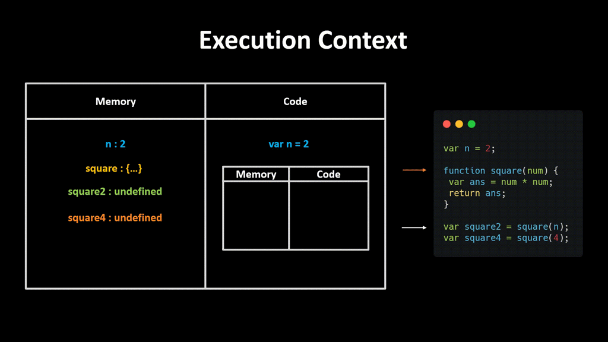

# **Hoisting**

## **What Is Hoisting?**
> JavaScript **Hoisting** refers to the process whereby the interpreter appears to move the declaration of functions, variables or classes to the top of their scope, prior to execution of the code.

<br />

Thus, variables can appear in code before they are even defined. However, the variable initialization will only happen until that line of code is executed.

```js
    func() // JS

    function func() {
        console.log('JS')
    }
```

<br />

## **Execution Context**

When a Javascript engine executes code, it creates execution context. Each context has two phases: creation and execution.

### **Creation Phase**

When a script executes, the JS engine creates a **Global Execution Context**. In this phase, it performs the following tasks:

- Create a global object ```window``` in the web browser or ```global``` in Node.js.
- Create the ```this``` object and bind it to the global object.
- Setup a memory heap for storing variables and function references.
- Store the function declarations in the memory heap and variables within the global execution context with the initial values as ```undefined```.

### **Execution Phase**
At this phase, the JS engine executes the code line by line. But by virtue of hoisting, the function is declared regardless of line order, so there is no problem calling/invoking the method prior the declaration.

For every function call, the JS engine creates a new **Function Execution Context**. This context is similar to **global execution context**, but instead of creating the global object, it creates the ```arguments``` object that contains references to all the parameters passed to the function

<br />
<br />

### **Execution of the code**
<br />

```js
var a = 2;
var b = 4;

var sum = a + b;

console.log(sum);
```

**Creation Phase**

**Execution Phase**


```js
var n = 2;

function square(num) {
 var ans = num * num;
 return ans;
}

var square2 = square(n);
var square4 = square(4);
```

**Creation Phase**

**Execution Phase**




<br />
<br />


> Only the declarations (function and variable) are hoisted

<br />

## **Variable hoisting**

JS only hoists declarations, **not initializations**. If a variable is used but it is only declared and initialized after, the value when it is used will be the default value on initialization.


<br />

For variables declared with the ```var``` keyword, the default value would be ```undefined```.

```js
    console.log(test) // undefined
    var test; // Declaration
    test = 2022; // Initialization
```
<p align='center'>OR</p>
<br />

```js
    console.log(test) // undefined

    var test = 2022;
```

Logging the ```test``` variable before it is initialized would print ```undefined```. If however, the declaration of the variable is removed, i.e.

```js
    console.log(test) // ReferenceError: test is not defined

    test = 2022; // Initialization
```

a ```ReferenceError``` exception would be thrown because no hoisting happened.

<br />

## **Strict Mode**

```strict mode``` does not allow undeclared variables.

```js
    'use strict';

    test = 2022; // ReferenceError: test is not defined
```


<br />

## **Function hoisting**

JavaScript functions can be loosely classified as the following:

1. Function declarations
2. Function expressions

We’ll investigate how hoisting is affected by both function types.

<br />

### **Function declarations**


```js
    func() // JS

    function func() {
        console.log('JS')
    }
```

<br />

### **Function expressions**


```js
    console.log(func) // undefined
    func() // Uncaught TypeError: func is not a function

    var func = function() {
        console.log('JS')
    }
```

<p align='center'>OR</p>
<br />

```js
    console.log(func) // undefined
    func() // Uncaught TypeError: func is not a function

    var func = function test() {
        console.log('JS')
    }
```

<br />

## **Order of precedence**

There are two rules you have to keep in mind when working with hoisted functions and 
variables:

It’s important to keep a few things in mind when declaring JavaScript functions and variables.

- Variable assignment takes precedence over function declaration
- Function declarations take precedence over variable declarations

> Function declarations are hoisted over variable declarations but not over variable assignments.

Let’s take a look at what implications this behaviour has.

<br />

**Variable assignment over function declaration**

```js
    var double = 22;

    function double(num) {
        return (num*2);
    }

    console.log(double); // 22
```

<br />

**Function declarations over variable declarations**

```js
    var double;

    function double(num) {
        return (num*2);
    }

    console.log(double); // function double(num) {...}
```
<p align='center'>OR</p>

```js
    function double(num) {
        return (num*2);
    }

    var double;

    console.log(double); // function double(num) {...}
```

Even if we reversed the position of the declarations, the JavaScript interpreter would still consider ```double``` a function.

<br />

## **Temporal Dead Zone (TDZ)**

Variables declared with ```let``` and ```const``` are also hoisted. However, unlike variables declared with ```var```, they are not initialized to a default value of ```undefined```. Until the line in which they are initialized is executed, any code that access them, will throw an exception. These variables are said to be in a "temporal dead zone" (TDZ) from the start of the block until the initialization has completed. Accessing unintialized ```let``` variables would result to a ```ReferenceError```.

```js
{ 
    // TDZ starts at beginning of scope
    console.log(varVariable); // undefined
    console.log(letVariable); // ReferenceError: Cannot access 'letVariable' before initialization"

    var varVariable = 1;
    let letVariable = 2; // End of TDZ (for letVariable)
}
```

The term "temporal" is used because the zone depends on the execution order (referring to time - temporal) rather than the order in which the code is written (position). However, the code snippet below will work because even though ```func``` uses the ```letVariable``` before it is declared, the function is called outside of the TDZ.

```js
{
    // TDZ starts at beginning of scope
    const func = () => console.log(letVariable); // 2022

    // Within the TDZ letVariable access throws `ReferenceError`

    let letVariable = 2022; // End of TDZ (for letVariable)
    func(); // Called outside TDZ!
}
```

<br />

## **Class hoisting**

JavaScript classes too can be loosely classified either as:

- Class declarations
- Class expressions

### **Class declarations**

JavaScript class declarations get hoisted during compile-time, but they don't get initialized with any value. These declarations behave similar to what we observed with hoisted ```const``` and ```let``` variable declarations. Even though JavaScript manages to find a reference for the class we created, we can not use it before it’s actually defined in the code.

```js
    console.log(Test); // ReferenceError: Cannot access 'Test' before initialization"

    class Test {}
```

### **Class expressions**

Class expressions, similar to function expressions, are assigned to variables; hence only the variable declarations get hoisted. Therefore we can not use class expressions before they are defined.

```js
    console.log(Test); // undefined

    var Test = class Test {}
```

```js
    console.log(Test); // undefined

    var Test = class {}
```

```js
    console.log(Test); // ReferenceError: Cannot access 'Test' before initialization"

    const Test = class {}
```

<br />

## **Examples**

```js
  console.log(test) // undefined
  if (false) {
    var test = 2022;
  }
  console.log(test) // undefined
```

```js
  console.log(test) // undefined
  if (true) {
    var test = 2022;
  }
  console.log(test) // 2022
```

```js
  console.log(test) // ReferenceError: test is not defined"
  test = 2022;
```

```js
  'use strict';
  test = 2022; // ReferenceError: test is not defined"
  console.log(test)
```

```js
  console.log(func) // undefined
  if (true) {
    var func = function test() {
      console.log(test) // function test() {...}
    }
    console.log(test) // ReferenceError: test is not defined"
  }
  console.log(func) // function test() {...}
```

```js
  console.log(test) // undefined or function test() {...} in old browsers. For example in IE10
  if (false) {
    function test() { }
  }
  console.log(test) // undefined or function test() {...} in old browsers. For example in IE10
```

```js
  console.log(test) // undefined or function test() {...} in old browsers. For example in IE10
  if (true) {
    console.log(test) // function test() {...}
    function test() { }
  }
  console.log(test) // function test() {...}
```

```js
  console.log(test()) // Second

  function test() {
    return 'First'
  }

  console.log(test()) // Second

  function test() {
    return 'Second'
  }

  console.log(test()) // Second
```

```js
  console.log(test()) // Second

  if (true) {
    console.log(test()) // First or Second in old browsers. For example in IE10

    function test() {
      return 'First'
    }
  }

  console.log(test()) // First or Second in old browsers. For example in IE10

  function test() {
    return 'Second'
  }

  console.log(test()) // First or Second in old browsers. For example in IE10
```

```js
  func()

  console.log(test) // ReferenceError: test is not defined"
  function func() {
    console.log(test) // undefined
    var test = 2022;
  }
```

```js
  console.log(test) // ReferenceError: test is not defined"
  if (true) {
    console.log(test) // ReferenceError: Cannot access 'test' before initialization"
    let test = 2022;
  }
  console.log(test) // ReferenceError: test is not defined"
```

```js
  console.log(test) // ReferenceError: test is not defined"
  if (true) {
    console.log(test) // ReferenceError: Cannot access 'test' before initialization"
    const test = 2022;
  }
  console.log(test) // ReferenceError: test is not defined"
```

```js
  console.log(test) // undefined
  var test = 2022;
  console.log(test) // 2022
  var test = 'JS';
  console.log(test) // JS
```

```js
  // SyntaxError: Identifier 'test' has already been declared"

  console.log(test)
  let test = 2022;
  console.log(test)
  let test = 'JS';
  console.log(test)
```

```js
  // SyntaxError: Missing initializer in const declaration"

  console.log(test)
  const test;
```

## **Summary**
- **Hoisting** refers to the process whereby the interpreter appears to move the declaration of functions, variables or classes to the top of their scope, prior to execution of the code.
- Only the declarations (function and variable) are hoisted.
- For variables declared with the ```var``` keyword, the default value would be ```undefined```.
- ```strict mode``` does not allow undeclared variables.
- Variables declared with ```let``` and ```const``` are also hoisted. However, unlike variables declared with ```var```, they are not initialized to a default value of ```undefined```.
- Class declarations get hoisted during compile-time, but they don't get initialized with any value. These declarations behave similar to what we observed with hoisted ```const``` and ```let``` variable declarations.
- Variable assignment takes precedence over function declaration.
- Function declarations take precedence over variable declarations.
- ```let``` and ```const```. Redeclaring the same variable within the same function or block scope raises a SyntaxError.